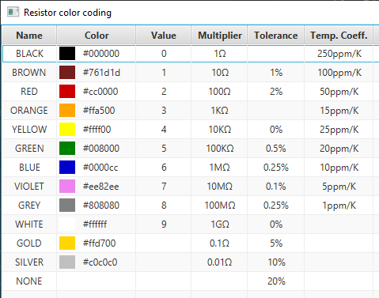
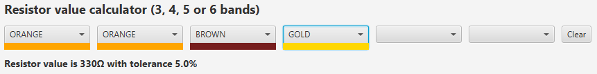
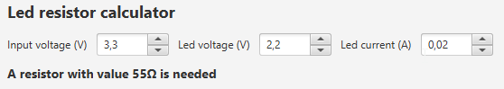

# Example application: visualize the Raspberry Pi pins with JavaFX
Resistor values and calculator application.

## Screenshots







## Maven project be.webtechie.resistor-calculator
* [Sources on GitHub](https://github.com/FDelporte/ResistorCalculator)
* [Maven repository](https://mvnrepository.com/artifact/be.webtechie/resistor-calculator)

## Build and run

```
$ mvn clean package
$ java -jar target/resistors-0.0.1-jar-with-dependencies.jar 
``` 