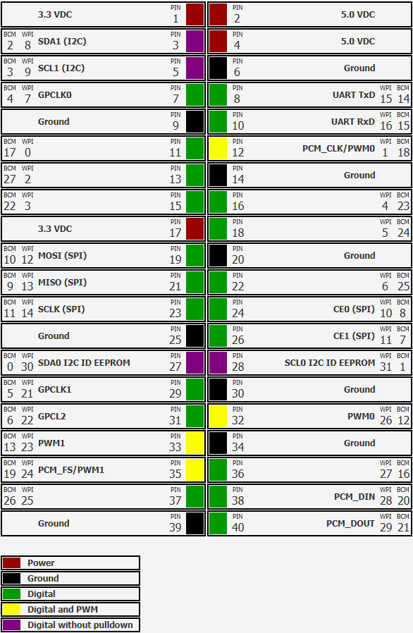

# Example application: visualize the Raspberry Pi pins with JavaFX
Information about the pinning layout of a Raspberry Pi.



## Maven project be.webtechie.pi-headers
* [Sources on GitHub](https://github.com/FDelporte/PiHeaders)
* [Maven repository](https://mvnrepository.com/artifact/be.webtechie/pi-headers)

## Build and run

```
$ mvn clean package
$ java -jar target/pinning-info-0.0.1-jar-with-dependencies.jar 
``` 