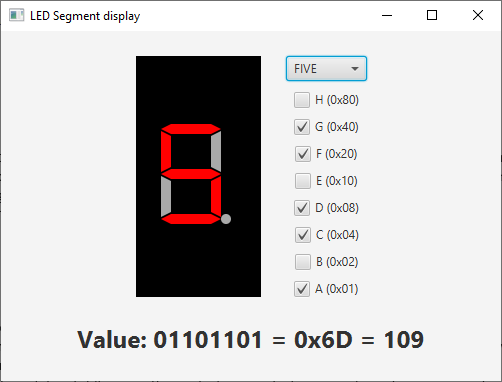
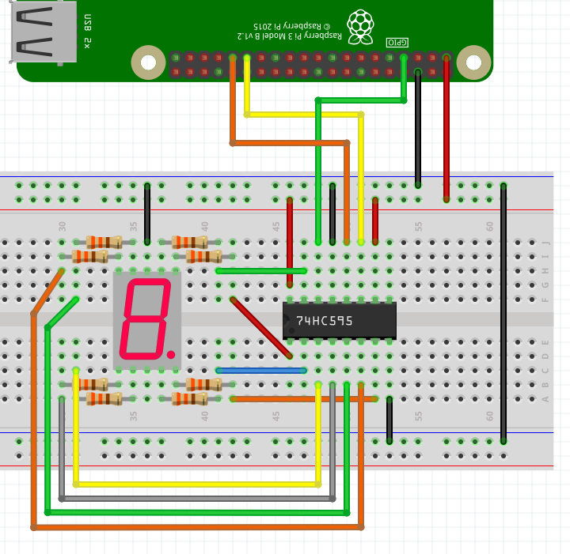

# JavaFX LED Number display controller

This application controls a LED number display by sending a number value to a Python script.

## Sources

Contains both
* The JavaFX application in src\main\java\be\webtechie\lednumberdisplaycontroller
* The Python script src\resources\shift.py which is copied to the /tmp/ directory on the Raspberry Pi at startup of the application

## Building the application

* This is a Maven project
* Open the terminal and run "mvn clean package"

## Running on Raspberry Pi

* To run on Raspberry Pi, use Liberica JDK (with included JavaFX) 
* Copy the generated jar from the target directory "led-number-display-controller-0.0.1-jar-with-dependencies.jar" to your Pi
* Run with "java -jar led-number-display-controller-0.0.1-jar-with-dependencies.jar"

## Wiring

By using a shift register only three GPIO's are used from the Raspberry Pi to control 8 LED segments.

## Inspired by

* [Raspberry PI and 74hc595 python example](http://www.pibits.net/code/raspberry-pi-and-74hc595-python-example.php)
* [7 Segment Display Units](https://circuitdigest.com/article/7-segment-display)
* [7-Segment display with 74HC595 shift register | Arduino Projects](https://simple-circuit.com/arduino-7-segment-74hc595-shift-register/)
* [Adafruit - Arduino Lesson 4. Eight LEDs and a Shift Register](https://learn.adafruit.com/adafruit-arduino-lesson-4-eight-leds/breadboard-layout)
* [Interfacing 74HC595 Serial Shift Register with Raspberry Pi](https://circuitdigest.com/microcontroller-projects/raspberry-pi-74hc595-shift-register-tutorial)
* [Multiplexing With Arduino and the 74HC595](https://www.instructables.com/id/Multiplexing-with-Arduino-and-the-74HC595/)
