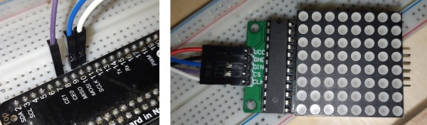
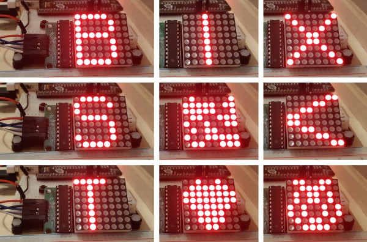

# Controlling a 8x8 LED matrix display with a MAX7219 controller

## Prepare the Raspberry Pi

### Full Raspbian OS with Java 11

Prepare an SD card with the latest full Raspbian OS and test the Java version when you're ready to start. Java 11 or higher is needed.

```
$ java -version
openjdk version "11.0.3" 2019-04-16 
OpenJDK Runtime Environment (build 11.0.3+7-post-Raspbian-5) 
OpenJDK Server VM (build 11.0.3+7-post-Raspbian-5, mixed mode)
```

### Install Pi4J

Pi4J is the "bridge" between Java and the GPIO's.

```
$ curl -sSL https://pi4j.com/install | sudo bash
```

### Upgrade WiringPi to version 2.52

Required when you are using a Raspberry Pi as the internal structure of the chip is different compared to the previous versions.

```
$ wget https://project-downloads.drogon.net/wiringpi-latest.deb
$ sudo dpkg -i wiringpi-latest.deb
$ gpio -v
gpio version: 2.52
```

## Wiring



## Result



## Read more
* [Displaying on MAX7219 Dot Matrix Using Raspberry Pi](https://tutorial.cytron.io/2018/11/22/displaying-max7219-dot-matrix-using-raspberry-pi/)
* [Connecting MAX7219_LED_MATRIX with SPI bus](https://einhugur.com/blog/index.php/xojo-gpio/connecting-max7219_led_matrix-with-spi-bus/)
* [How to Use the MAX7219 to drive an 8x8 LED display Matrix on the Arduino](https://www.best-microcontroller-projects.com/max7219.html)
* [Pixel scrolling of a text message on 8x8 LED matrix displays with a MAX7219](https://picaxeforum.co.uk/threads/pixel-scrolling-of-a-text-message-on-8x8-led-matrix-displays-with-a-max7219.31594/)