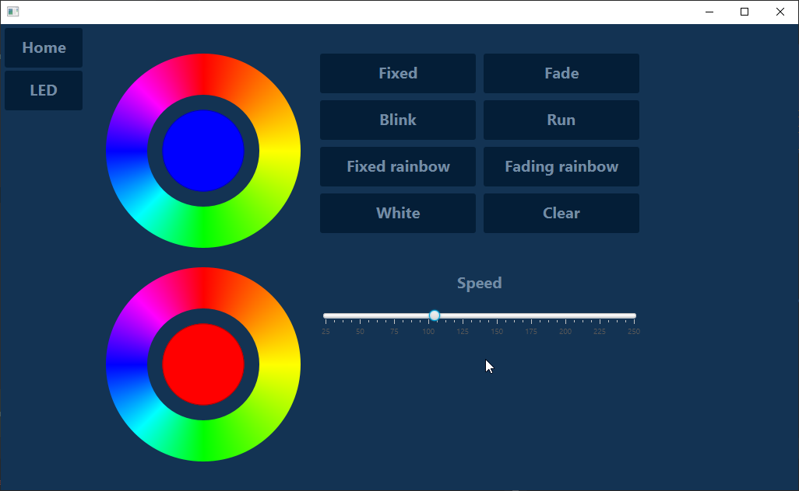

# JavaFX LED controller application
JavaFX application to control a LED strip via Arduino with commands via Mosquitto

## Desciption
* Uses JavaFX for the UI
* Uses Undertow for the webservices

## Dependencies
* Spring
* Java 11 and JavaFX 11

### Inspired by 
* [Gerrit Grunwald aka hansolo_](https://twitter.com/hansolo_)
    * [ColorSelector](https://github.com/HanSolo/ColorSelector)
* [Getting Started on Undertow Server](https://www.findbestopensource.com/article-detail/getting-started-undertow) 

## Development
* Easiest way to develop is by using the Liberica Java 11.0.3 SDK (which includes JavaFX)

